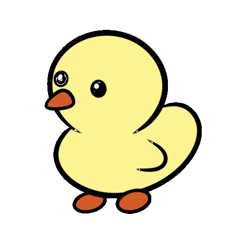

<h1 align="center">MAZE OF DUCKS</h1>

## Project Overview  
For my school project, I created a maze and turned it into a simple interactive game. The goal was to design both the visual layout and the functionality. The maze itself was generated on this website: https://worksheets.theteacherscorner.net/make-your-own/maze/, which helped me create a structured and playable design.

## Theme  
I chose a duck theme to make the game fun and colorful. The playful design makes it more engaging and easy to follow.

  

## Background Music  
I added the song *“Five Little Ducks”* as background music to match the theme and create a more enjoyable experience.

## Technologies Used  
- **HTML** – structure of the game  
- **CSS** – design and layout  
- **JavaScript** – interactivity and movement  

## Functionality  
The player can move through the maze and try to reach the end. The game responds to movement and detects walls.

## Conclusion  
This project helped me combine design and programming into a functional game, while also making it creative and fun.

